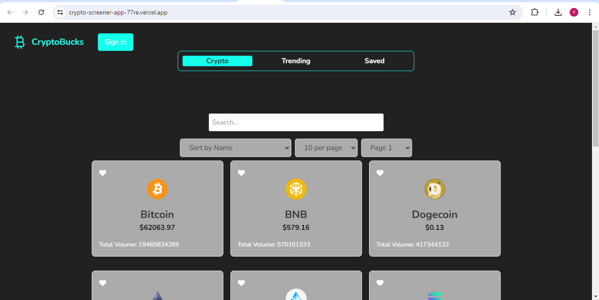
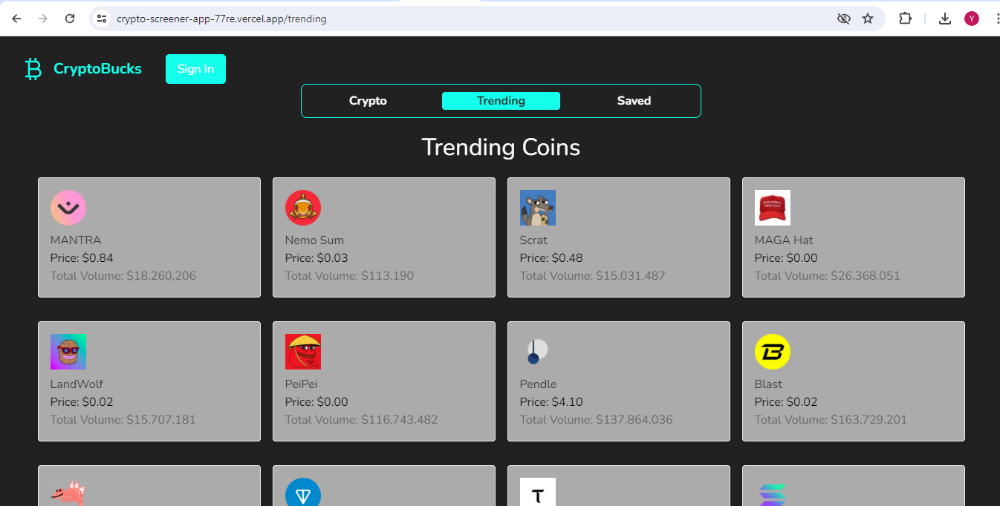
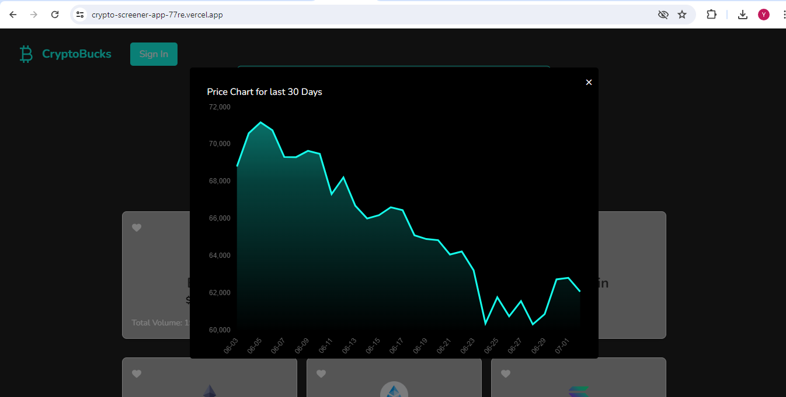
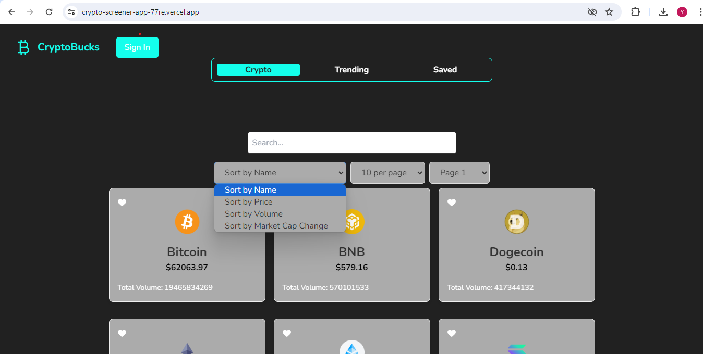
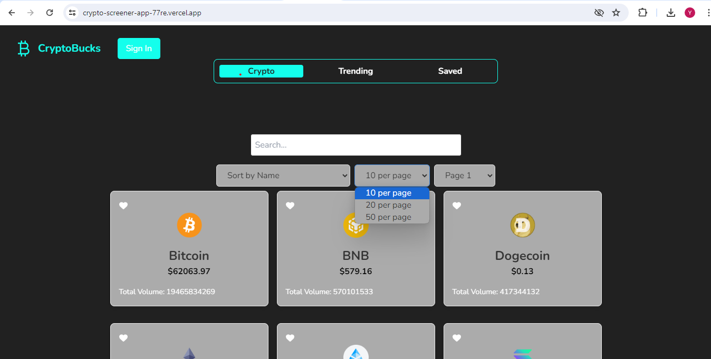
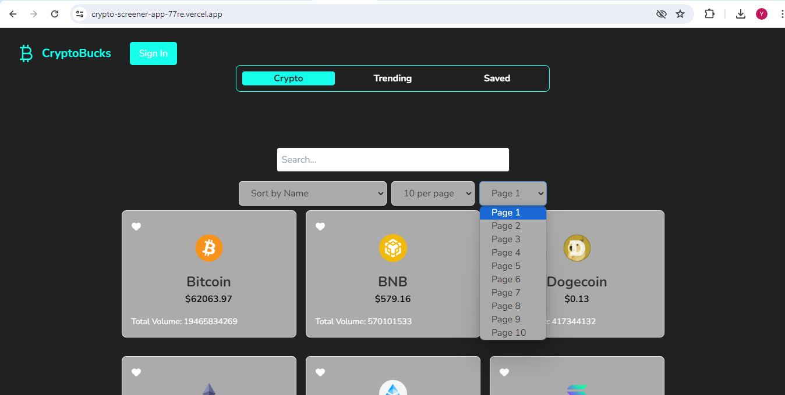
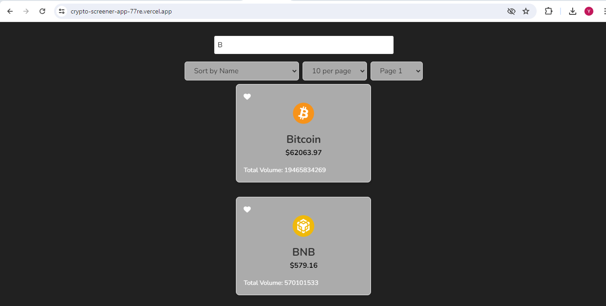
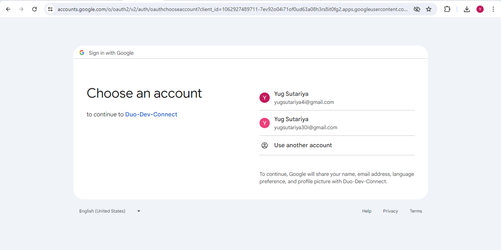
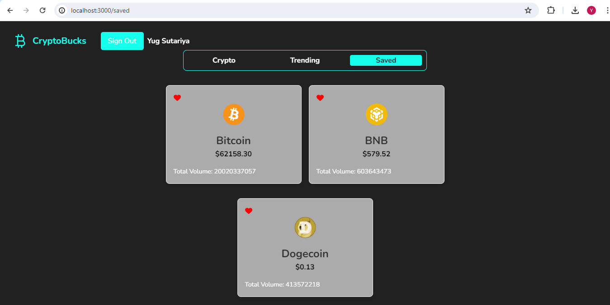

# Crypto Screener App
Fully featured Crypto Screener application that uses a Crypto API provided by CoinGecko. This
application will allow you to search, sort, and view details about various cryptocurrencies,
including their charts and data.

## Deployed Production Link
- https://crypto-screener-app-77re.vercel.app/

## Features
- Home Page (Yug, Jay, Darshan)
- Trending Page (vasuki)
- Saved Page (Jay, Simranjit)
- Navbar (Simranjit)
- Login (Jay)
- Sort by Name, Price, Volume, Market Cap (Yug, Vasuki)
- Pagination (Yug, Darshan)
- Individual Coin graph (Jay, Yug)
- Search Functionality (Yug)
- UI Design (Simranjit, Darshan, Vasuki)
- Bug Fixing (Jay, Yug, Vasuki, Simranjit, Darshan)
- Deployment (Darshan, Vasuki)

## Note
- We have used CoinGecko API for our project. CoinGecko has implemented rate limit in the API which is causing problem in retrieving data from it sometimes. 
- Also, Saved Functionality is not working in deployed environment because we are signing in user with google account. So we are attaching a video of working Functionality in local machine.

## Screenshots
### Home Page

### Trending Page

### Chart

### Filters

### Pagination 1

### Pagination 2

### Search

### Login

### Saved 1

### Saved 2

### Video
https://drive.google.com/file/d/1TkJYwRJR9Uw7NxLjrqYhddUAchw_FcNU/view?usp=sharing
